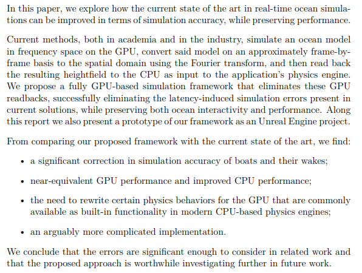

# Improving the Accuracy of FFT-based GPGPU Ocean Surface Simulations

Master’s thesis in computer science and engineering conducted at Chalmers University of Technology in collaboration with Rapid Images. Thesis and project conducted by:
- Jacob Eriksson
- Joakim Wingård

## Abstract

## Resources

See the [res](res) directory for the [report](res/final_report.pdf), the [presentation slides](res/final_presentation.pdf), and some demo videos.

Disclaimer: the boat model used in our prototype is not publicly available.